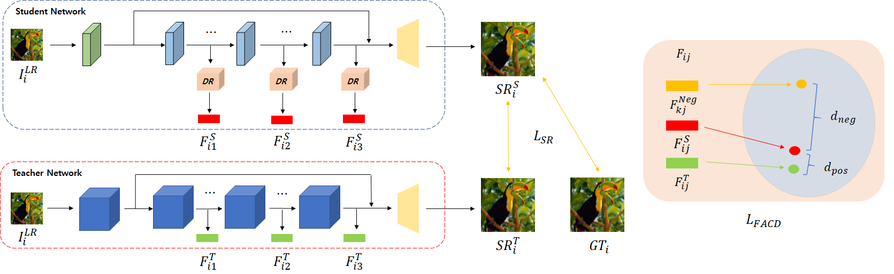

# Feature-domain Contrastive Adaptive Distillation for Efficient Single Image Super-reoslution (FACD)

This repo is the official implementation of "Feature-domain Contrastive Adaptive Distillation for Efficient Single Image Super-resolution (FACD)".

pre-trained model and code are coming soon.

"In this study, we propose a feature-domain adaptive contrastive distillation (FACD) method to train lightweight student SISR networks efficiently. We highlight the limitations of existing FD methods in terms of Euclidean distance-based loss, and propose a feature-domain contrastive loss, which causes student networks to learn richer information from the teacher's representation in the feature domain. We also implement adaptive distillation that performs distillation selectively depending on the conditions of the training patches. Experimental results showed that the proposed FACD scheme improves student enhanced deep residual networks and residual channel attention networks not only in terms of the peak signal-to-noise ratio on all benchmark datasets and scales but also in terms of subjective image quality, compared to the conventional FD approaches."

### Methods

